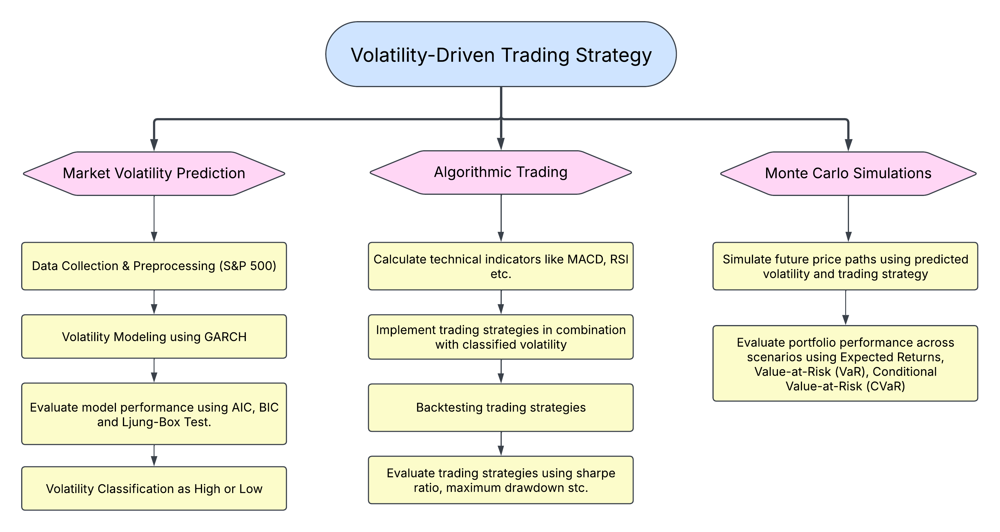
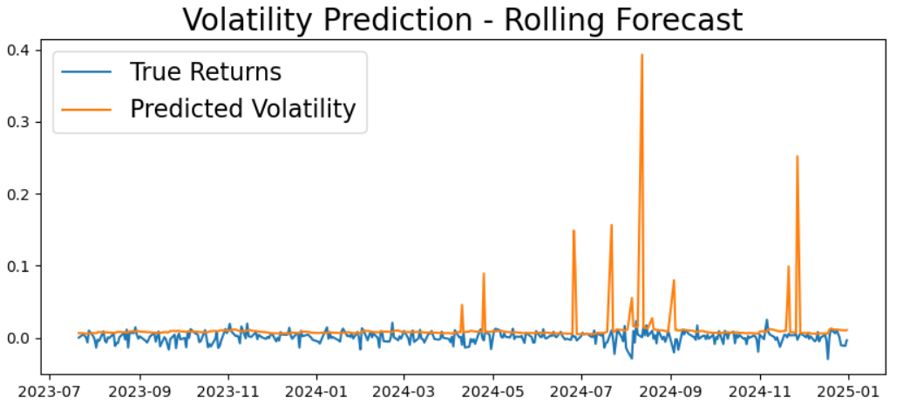
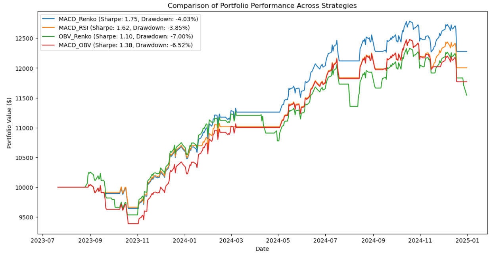
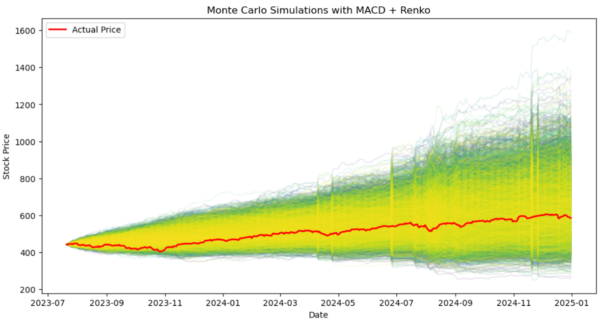

# Volatility-Driven Trading Strategy Using GARCH Models, Technical Indicators, and Monte Carlo Simulations

## Overview
This project develops a trading strategy that leverages volatility modeling (GARCH models), technical indicators, and Monte Carlo simulations to optimize trading decisions. The strategy is backtested on **S&P 500 stock data** to evaluate performance.

## Key Features
- **Volatility Modeling:** GARCH(2,2) for one-day-ahead volatility prediction.
- **Technical Indicators:** MACD, RSI, OBV, Renko Trend, Resistance Levels.
- **Backtested Strategies:** Evaluated Sharpe Ratio, Max Drawdown, and Win Ratio.
- **Monte Carlo Simulation:** 10,000 price path simulations to forecast market trends.
- **Risk Assessment:** Value-at-Risk (VaR) and Conditional VaR (CVaR).

---

## Project Flow


---

## 1. Market Volatility
Volatility measures the price fluctuation of an asset and is calculated as:

```
σ = sqrt((1/N) * Σ(ri - r̄)²)
```

Where `ri` is the return on day i and `r̄` is the mean return.

---

## 2. Data Collection & Preprocessing
- **Dataset:** S&P 500 historical stock data (last 10 years) from Yahoo Finance.
- **Preprocessing:**
  - Convert prices to percentage returns for stationarity.
  - Stationarity tests:
    - Augmented Dickey-Fuller (ADF) Test

---

## 3. Volatility Modeling Using GARCH
### GARCH Model
GARCH (Generalized Autoregressive Conditional Heteroskedasticity) models volatility clustering:

```
σ²_t = α₀ + Σ(αᵢ * r²_{t−ᵢ}) + Σ(βⱼ * σ²_{t−ⱼ})
```

### Alternative Models
- **EGARCH:** Captures asymmetric volatility.
- **TGARCH:** Differentiates positive and negative shocks.

### Model Selection Criteria
- Akaike Information Criterion (AIC)
- Bayesian Information Criterion (BIC)
- Ljung-Box Test (for residual autocorrelation)

**Selected Model:** GARCH(2,2)

---

## 4. Rolling Window Forecasting
- Trained GARCH(2,2) using a 365-day rolling window.
- Forecasted one-day-ahead volatility iteratively.



---

## 5. Trading Strategies with Technical Indicators

| Strategy              | Buy Signal                                             | Sell Signal                                            |
|----------------------|--------------------------------------------------------|--------------------------------------------------------|
| **MACD_Renko**       | MACD > Signal and Renko Trend = 1                      | MACD < Signal and Renko Trend = -1                     |
| **MACD_RSI**         | MACD > Signal and RSI > 30                             | MACD < Signal and RSI < 70                             |
| **OBV_Renko**        | OBV rising and Renko Trend = 1                         | OBV falling and Renko Trend = -1                       |
| **MACD_OBV**         | MACD > Signal and OBV rising                           | MACD < Signal and OBV falling                          |

> **Note:** Strategies are only executed in high-volatility conditions.

---

## 6. Backtesting Trading Strategies



**Evaluation Metrics:**
- Sharpe Ratio (risk-adjusted return)
- Max Drawdown (maximum loss)
- Win Ratio (winning trades percentage)

**Best Performing Strategy:**
- **MACD_Renko**
  - Sharpe Ratio: 1.75
  - Portfolio Return: 22.76%

---

## 7. Monte Carlo Simulations for Future Price Paths



Simulated 10,000 price paths using:

```
P_{t+1} = P_t * exp(μ_t + σ_t * Z)
```

Where:
- `μ_t` is adjusted based on MACD_Renko signals:
  - BUY → increase `μ_t`
  - SELL → decrease `μ_t`
- `σ_t` is GARCH-predicted volatility (capped at 5%)
- `Z` is a random variable from standard normal distribution (N(0,1))

### Trading Execution
- Signals generated using simulated price paths.
- Trades executed using actual market prices.

### Portfolio Calculation
```
V_t = V_{t-1} * (1 + r_t)
```
Where `r_t` is the return from executed trades.

---

## 8. Risk Management
### Value-at-Risk (VaR):
Estimated worst-case loss under normal market conditions:
```
VaR_α = - Quantile(returns, α)
```

### Conditional VaR (CVaR):
Expected loss beyond VaR threshold:
```
CVaR_α = Average loss when loss > VaR_α
```

---

## 9. Results & Conclusion
- MACD_Renko outperforms all other strategies.
- Monte Carlo simulation reflects market trend patterns.
- Risk-adjusted performance is significantly improved.

---

## 10. Installation & Usage
### Prerequisites
- Python 3.8+
- Jupyter Notebook
- Required Libraries:
```bash
pip install numpy pandas matplotlib seaborn statsmodels arch yfinance
```

### Run the Notebook
```bash
jupyter FinQuest.ipynb
```

---

## 11. Future Improvements
- Deep Learning for Volatility Forecasting
- Multi-Asset Trading Strategies
- Integration of Options and Implied Volatility Models
